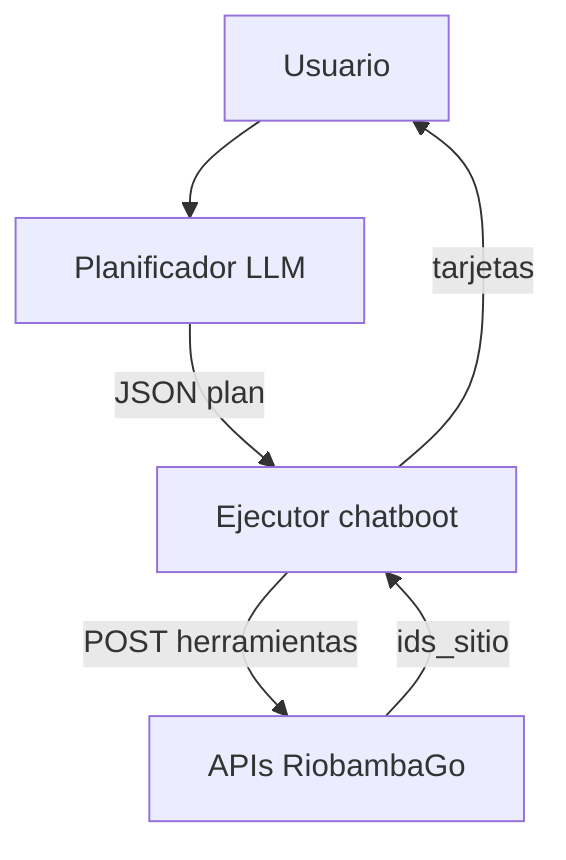
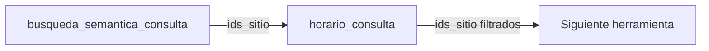
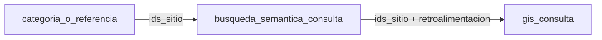

# Arquitectura APIs Chatboot

Serie de herramientas HTTP consumidas por el planificador del chatboot (`chatboot/application/nodes/chatboot_exploracion`). Base: `/api/v1/chatboot/herramientas`.

No requieren autenticación JWT. Deben exponerse en la red interna del proyecto.

## Índice de herramientas (H1–H13)

| # | Herramienta | Endpoint | Salida principal |
|---|-------------|----------|------------------|
| 1 | busqueda_semantica_consulta | `POST .../busqueda-semantica-consulta` | `ids_sitio` + `candidatos` debug + `retroalimentacion` |
| 2 | busqueda_referencia | `POST .../busqueda-referencia` | `ids_sitio` |
| 3 | contacto_busqueda | `POST .../contacto-busqueda` | `ids_sitio` |
| 4 | horario_consulta | `POST .../horario-consulta` | `ids_sitio` |
| 5 | precio_consulta | `POST .../precio-consulta` | `ids_sitio` |
| 6 | tarifa_acceso_consulta | `POST .../tarifa-acceso-consulta` | `ids_sitio` |
| 7 | atributos_booleanos_consulta | `POST .../atributos-booleanos-consulta` | `ids_sitio` |
| 8 | gis_consulta | `POST .../gis-consulta` | `ids_sitio`/`ids_ruta` + `candidatos` con distancia + `retroalimentacion` |
| 9 | ruta_consulta | `POST .../ruta-consulta` | `ids_ruta` |
| 10 | pregunta_directa | `POST .../pregunta-directa` | `ids_sitio` + sitio resuelto |
| 11 | historial_exploracion | `POST .../historial-exploracion` | Persistencia de turno en `conversacion.mensaje_explorador` |
| 12 | historial_pregunta_directa | `POST .../historial-pregunta-directa` | Persistencia en `conversacion.mensaje_detalle` |

Probador unificado: `apis/tests/probar_apis_chatboot.py` (menú interactivo y flags `--herramienta`, `--caso`, `--verificar-pipeline*`).

Documentación legacy del monolito `chatboot_reutilizar`: [`chatboot_apis.md`](chatboot_apis.md) (referencia histórica; las herramientas nuevas viven bajo `/chatboot/herramientas/`).

Índice general de documentación: [`README.md`](README.md).

## Flujo general



## Historial De Exploración

Endpoint interno usado por el chatboot al terminar el armado del JSON final para móvil.

```http
POST /api/v1/chatboot/herramientas/historial-exploracion
```

Request:

```json
{
  "id_usuario": 1,
  "sesion_id": "uuid-sesion",
  "client_message_id": "uuid-mensaje",
  "texto_usuario": "Busco restaurantes con wifi",
  "respuesta_json": {
    "pregunta_chatboot": "exploracion",
    "exploracion": {
      "mensajes_app": []
    }
  },
  "categorias": ["Alimentos y Bebidas"],
  "subcategorias": ["Restaurante"]
}
```

Response:

```json
{
  "id_conversacion": 10,
  "client_message_id": "uuid-mensaje",
  "usuario_guardado": true,
  "respuesta_guardada": true,
  "mensaje": "Historial de exploración procesado."
}
```

Reglas:

- Busca o crea `conversacion.conversacion` con `id_usuario + sesion_id`.
- Inserta dos filas en `conversacion.mensaje_explorador` con el mismo `client_mensaje_id`.
- La fila del usuario usa `rol="usuario"`, `contenido=texto_usuario` y `embedding` de 1024 dimensiones.
- La fila de respuesta usa `rol="conversacion_general"`, `contenido` con el JSON final serializado y `embedding=NULL`.
- `categorias` y `subcategorias` pueden ser `null`.
- La operación es idempotente por `id_conversacion + client_mensaje_id + rol`; un reintento no duplica filas.
- El rol de respuesta de exploración usa `conversacion_general` porque el enum actual no incluye `chatboot_exploracion`.

## Historial Pregunta Directa

Endpoint interno al cerrar un turno del chatbot de sitio (canal WebSocket pregunta directa).

```http
POST /api/v1/chatboot/herramientas/historial-pregunta-directa
```

Persiste usuario y respuesta en `conversacion.mensaje_detalle` asociado a la entidad/sitio.
Idempotente por conversación + `client_message_id`. Los embeddings del mensaje de usuario
se generan con Voyage (`input_type=query`) para analítica del panel.

Cada herramienta acota o filtra un conjunto de `id_sitio`. El planificador las encadena según `crear_plan.md` (macro a micro; `gis` siempre al final).

### Campo transversal `ids_consulta`

Todas las herramientas aceptan `ids_consulta: number[]` (default `[]`) para encadenar filtros en el pipeline del ejecutor.

| Valor | Comportamiento |
|-------|----------------|
| `[]` | Evalúa el universo completo de sitios activos (comportamiento por defecto). En **ruta_consulta**, universo de rutas activas. |
| `[1, 2, 3]` | Solo evalúa esos candidatos (intersección con el filtro de la herramienta). En **gis_consulta** con `entidad: "ruta"`, son IDs de `gis.rutas_turistica`. |

Ejemplo de pipeline (hoteles abiertos ahora):



```json
// Paso 1
POST .../busqueda-semantica-consulta
{ "texto_embeddings": "hoteles para hospedarse en chimborazo", "keywords": ["hotel"], "ids_consulta": [] }

// Paso 2
POST .../horario-consulta
{
  "tipo": "instantaneo",
  "dia_semana": null,
  "dias_semana": null,
  "hora": null,
  "rango_hora": null,
  "comparador": "",
  "excluir_dias": [],
  "ids_consulta": [1, 2, 3]
}
```

Módulos compartidos: `apis/esquemas/chatboot_comun.py` (`FiltroIdsConsulta`), `apis/core/infra/filtro_sitios.py`.

### Pipeline rutas y GIS (contrato planificador y ejecutor)

Cuando el plan encadena `ruta` y luego `gis`, el ejecutor debe propagar `ids_ruta` del paso anterior como `ids_consulta` del paso GIS, y el plan **debe** incluir `"entidad": "ruta"` en los parámetros de GIS.

> **Nota:** Si GIS va después de `ruta` y el plan omite `"entidad": "ruta"`, GIS asumirá `entidad: "sitio"` (valor por defecto). Los IDs del paso anterior son de `gis.rutas_turistica`, no de `turismo.sitio`, por lo que el filtro fallará o devolverá resultados incorrectos. **Siempre declarar `"entidad": "ruta"` cuando GIS siga a la herramienta `ruta`.**

Ejemplo de plan válido (clasificación del planificador):

```json
{
  "consultas": [
    {
      "ejecucion_herramienta": [
        {
          "orden": 1,
          "herramienta": {
            "nombre": "ruta",
            "parametros": {
              "tipo_ruta": "senderismo",
              "excluir_tipos": []
            }
          }
        },
        {
          "orden": 2,
          "herramienta": {
            "nombre": "gis",
            "parametros": {
              "entidad": "ruta",
              "usar_ubicacion_usuario": true,
              "distancia": null,
              "unidad": "",
              "punto_referencia": "",
              "excluir_zonas": []
            }
          }
        }
      ]
    }
  ]
}
```

Ejemplo de ejecución HTTP (paso 1 → paso 2):

```json
// Paso 1 — ruta_consulta
POST .../ruta-consulta
{ "tipo_ruta": "senderismo", "excluir_tipos": [], "ids_consulta": [] }
// → { "ids_ruta": [4, 5, 7] }

// Paso 2 — gis_consulta (obligatorio entidad=ruta)
POST .../gis-consulta
{
  "entidad": "ruta",
  "usar_ubicacion_usuario": true,
  "ubicacion_usuario": { "lat": -1.6736, "lon": -78.6473 },
  "distancia": null,
  "unidad": "",
  "punto_referencia": "",
  "excluir_zonas": [],
  "ids_consulta": [4, 5, 7]
}
// → { "ids_ruta": [4] }
```

Pendiente de implementación en el ejecutor del chatboot: detectar el pipeline `ruta` → `gis`, mapear `ids_ruta` → `ids_consulta`, inyectar `ubicacion_usuario` del cliente cuando `usar_ubicacion_usuario` es `true`, y rechazar o corregir planes GIS sin `entidad` coherente con el paso previo.

---

## Herramienta 1 · categoria_subcategoria

**Propósito:** primer filtro del pipeline. Acota el universo de sitios activos según categorías o subcategorías del catálogo turístico.

**Ruta:**

```http
POST /api/v1/chatboot/herramientas/categoria-subcategoria
```

### Request

```json
{
  "categorias_sugeridas": ["Manifestaciones Culturales"],
  "subcategorias_sugeridas": ["Museo"],
  "excluir_categorias": [],
  "ids_consulta": []
}
```

| Campo | Tipo | Descripción |
|-------|------|-------------|
| `categorias_sugeridas` | `string[]` | Nombres de categoría inferidos por el planificador (hasta 3 con confianza parcial). |
| `subcategorias_sugeridas` | `string[]` | Nombres de subcategoría inferidos. Si la subcategoría es clara, el planificador solo llena este campo. |
| `excluir_categorias` | `string[]` | Términos a excluir por coincidencia parcial (`ILIKE`) sobre nombre de categoría o subcategoría. |
| `ids_consulta` | `number[]` | Candidatos previos del pipeline; vacío = todos los sitios activos. |

Al menos una de `categorias_sugeridas` o `subcategorias_sugeridas` debe tener valores no vacíos.

### Response

Tres variantes mutuamente excluyentes (siempre HTTP 200 salvo error de validación 422):

**Éxito** — sitios encontrados:

```json
{
  "ids_sitio": [12, 45, 78]
}
```

**Sin sitios** — nombres resueltos pero ningún sitio activo cumple (o todos quedan excluidos):

```json
{
  "sin_sitios": "Ningún sitio cumple con las categorías o subcategorías indicadas."
}
```

**Fallo** — no se pudo resolver ningún nombre del catálogo:

```json
{
  "fallo": "No se pudo resolver ninguna categoría o subcategoría sugerida: zzz_inexistente."
}
```

| Campo respuesta | Cuándo |
|-----------------|--------|
| `ids_sitio` | Al menos un sitio activo coincide |
| `sin_sitios` | Resolución OK, 0 sitios tras filtros |
| `fallo` | Ningún nombre sugerido mapeó al catálogo |

### Lógica interna

1. **Resolución de nombres** con `pg_trgm` (`similarity` / `word_similarity`, umbral 0.40) contra `turismo.categoria` y `turismo.subcategoria`.
2. **Unión OR** entre sugerencias: un sitio coincide si su `id_categoria` está en **cualquiera** de las categorías resueltas **o** su `id_subcategoria` está en **cualquiera** de las subcategorías resueltas. Varias categorías en la misma lista amplían el resultado; lo mismo con varias subcategorías. Si llegan ambas listas, se unen todos los conjuntos (no es intersección).
3. **Resolución parcial:** si algunos nombres no resuelven pero otros sí, se usan los válidos y se devuelven sus sitios.
4. **Exclusiones:** `NOT (c.nombre ILIKE '%término%' OR sub.nombre ILIKE '%término%')` por cada entrada en `excluir_categorias`.
5. Solo sitios con `activo = TRUE`.

### Ejemplos del planificador

Solo subcategoría (caso típico cuando el LLM identifica el tipo concreto):

```json
{
  "categorias_sugeridas": [],
  "subcategorias_sugeridas": ["Museo"],
  "excluir_categorias": []
}
```

Solo categoría:

```json
{
  "categorias_sugeridas": ["Alojamiento"],
  "subcategorias_sugeridas": [],
  "excluir_categorias": []
}
```

Confianza parcial (hasta 3 sugerencias, unión de resultados):

```json
{
  "categorias_sugeridas": ["Atractivos Naturales", "Manifestaciones Culturales"],
  "subcategorias_sugeridas": [],
  "excluir_categorias": []
}
```

Varias subcategorías a la vez (unión OR):

```json
{
  "categorias_sugeridas": [],
  "subcategorias_sugeridas": ["Museo", "Iglesia"],
  "excluir_categorias": []
}
```

Categorías y subcategorías combinadas (unión de todos los filtros):

```json
{
  "categorias_sugeridas": ["Alojamiento", "Atractivos Naturales"],
  "subcategorias_sugeridas": ["Museo", "Iglesia"],
  "excluir_categorias": []
}
```

### Módulos del código

| Capa | Archivo |
|------|---------|
| Esquemas | `apis/esquemas/categoria_subcategoria.py` |
| Servicio | `apis/servicios/categoria_subcategoria.py` |
| Ruta | `apis/rutas/categoria_subcategoria.py` |

Reutiliza resolvers trigram de `apis/core/catalogo_trgm.py`.

### Diferencia con API legacy

La API en `chatboot_reutilizar` (`POST /api/v1/chatboot/categoria-subcategoria`, router comentado) usa contrato **singular** (`categoria`, `subcategoria`, `ids_sitios_candidatos`) y respuesta detallada (`ok`, `total`, `sitios`, `alcance_aplicado`, `tiempo_ms`). La nueva herramienta usa **listas** alineadas con `crear_plan.md` y respuesta simplificada para el ejecutor del chatboot.

### Pruebas manuales

**Desde la raíz del proyecto** (`~/RiobambaGo`):

```bash
cd apis && .venv/bin/python tests/probar_apis_chatboot.py
```

**Si ya estás en `apis/`** (no hagas `cd apis` otra vez):

```bash
.venv/bin/python tests/probar_apis_chatboot.py
```

Prueba rápida de un caso sin menú:

```bash
.venv/bin/python tests/probar_apis_chatboot.py --caso 1
.venv/bin/python tests/probar_apis_chatboot.py --verificar
.venv/bin/python tests/probar_apis_chatboot.py --help
```

Variables de entorno: `APIS_BASE_URL` (default `http://localhost` vía nginx). El probador usa HTTP, no PostgreSQL directo.

Alternativa en contenedor:

```bash
docker exec riobambago-apis python tests/probar_apis_chatboot.py --verificar
```

---

## Herramienta 2 · busqueda_referencia

**Propósito:** acotar sitios por dirección textual, parroquia o plataforma mencionada por el usuario (no coordenadas).

**Ruta:**

```http
POST /api/v1/chatboot/herramientas/busqueda-referencia
```

### Request

```json
{
  "direccion_referencia": "jose veloz y morona",
  "ids_consulta": []
}
```

| Campo | Tipo | Descripción |
|-------|------|-------------|
| `direccion_referencia` | `string` | Calle, dirección, parroquia o plataforma inferida por el planificador. |
| `ids_consulta` | `number[]` | Acota la búsqueda a esos sitios candidatos. |

### Response

Mismo contrato simplificado que `categoria_subcategoria`: `ids_sitio`, `sin_sitios` o `fallo` (HTTP 200).

**Éxito:**

```json
{
  "ids_sitio": [1]
}
```

### Lógica interna (dos fases)

1. **Fase trigram (`pg_trgm`, umbral 60%)** sobre:
   - `turismo.direccion` (`direccion_texto`, `referencia_adicional`)
   - `turismo.parroquia` (`nombre`)
   - `turismo.plataforma` (`nombre`)

2. **Fase refinamiento (umbral 90%)** con `rapidfuzz`: normaliza texto, quita prefijos de vía (`av.`, `calle`, `avenida`, etc.) y vuelve a comparar consulta vs candidato.

3. **Prioridad por longitud:**
   - Más de 3 palabras → prioriza coincidencias en **dirección** (devuelve `id_sitio` de direcciones que superen 90%).
   - 3 palabras o menos → prioriza **plataforma** o **parroquia** (devuelve todos los sitios activos de esa plataforma/parroquia).

4. Solo sitios con `activo = TRUE`.

### Ejemplos

Dirección larga (prioriza calle):

```json
{ "direccion_referencia": "Av. Jose Veloz y Morona" }
```

Parroquia (pocas palabras):

```json
{ "direccion_referencia": "RIOBAMBA" }
```

### Módulos del código

| Capa | Archivo |
|------|---------|
| Esquemas | `apis/esquemas/busqueda_referencia.py` |
| Servicio | `apis/servicios/busqueda_referencia.py` |
| Ruta | `apis/rutas/busqueda_referencia.py` |
| Utilidades texto | `apis/core/busqueda_texto.py` |

### Prueba rápida

```bash
.venv/bin/python tests/probar_apis_chatboot.py --herramienta referencia --caso 1
```

---

## Herramienta 3 · contacto_busqueda

**Propósito:** filtrar sitios que tienen un canal de contacto concreto (whatsapp, teléfono, email, etc.).

**Ruta:**

```http
POST /api/v1/chatboot/herramientas/contacto-busqueda
```

### Request

```json
{
  "contacto_sugerido": "whatsapp",
  "excluir_contactos": [],
  "ids_consulta": []
}
```

| Campo | Tipo | Descripción |
|-------|------|-------------|
| `contacto_sugerido` | `string` | Nombre del contacto inferido por el planificador (`whatsapp`, `telefono`, `email`, `web`, etc.). |
| `excluir_contactos` | `string[]` | Excluye sitios que también tengan un contacto que coincida con estos términos. |
| `ids_consulta` | `number[]` | Acota la búsqueda a esos sitios candidatos. |

### Response

Mismo contrato base: `ids_sitio`, `sin_sitios` o `fallo`. En éxito y `sin_sitios` puede incluir `candidatos` como evidencia compacta para redacción:

```json
{
  "ids_sitio": [69],
  "candidatos": [
    {
      "id_sitio": 69,
      "abierto_24h": false,
      "horario_texto": "Lun: 09:00-17:00",
      "comentario": "Atención bajo reservación",
      "cumplimiento_condicional": true,
      "dias_semana_resueltos": [1],
      "hora_consultada": "15:00",
      "criterio_cumplido": true
    }
  ]
}
```

### Lógica interna

1. Busca en `turismo.contacto.nombre` con `pg_trgm` (umbral **90%**).
2. Índice GIN: `idx_contacto_texto_trgm`.
3. Solo contactos y sitios con `activo = TRUE`.
4. Devuelve `id_sitio` distintos ordenados.
5. `excluir_contactos` quita sitios que tengan algún contacto activo que también supere el 90% con el término excluido.

### Esquema DB (actual)

```sql
turismo.contacto (id_contacto, id_sitio, nombre, contenido, activo)
```

El campo `nombre` almacena el tipo de contacto (`telefono`, `whatsapp`, `email`, …), no el número o URL.

### Módulos del código

| Capa | Archivo |
|------|---------|
| Esquemas | `apis/esquemas/contacto_busqueda.py` |
| Servicio | `apis/servicios/contacto_busqueda.py` |
| Ruta | `apis/rutas/contacto_busqueda.py` |

### Prueba rápida

```bash
.venv/bin/python tests/probar_apis_chatboot.py --herramienta contacto --caso 1
```

---

## Herramienta 4 · horario_consulta

**Propósito:** filtrar sitios según horario de atención (abierto ahora, día concreto, franja horaria, etc.). Zona horaria: `America/Guayaquil`.

**Ruta:**

```http
POST /api/v1/chatboot/herramientas/horario-consulta
```

### Request

```json
{
  "tipo": "instantaneo",
  "dia_semana": null,
  "hora": null,
  "rango_hora": null,
  "comparador": "",
  "excluir_dias": [],
  "ids_consulta": []
}
```

| Campo | Tipo | Descripción |
|-------|------|-------------|
| `tipo` | `instantaneo` \| `punto_tiempo` \| `bloque_tiempo` \| `relacional` \| `dias_solamente` | Modo de evaluación (contrato del planificador). |
| `dia_semana` | `int \| null` | 1=lunes … 7=domingo. Default: hoy (Guayaquil) cuando aplica. |
| `dias_semana` | `int[] \| null` | Conjunto de días a incluir. Ej. fines de semana `[6,7]`, lunes a viernes `[1,2,3,4,5]`. Tiene prioridad sobre `dia_semana` cuando llega con valores. |
| `hora` | `string \| null` | `HH:MM`. Requerida en `punto_tiempo` y `relacional`. |
| `rango_hora` | `string[] \| null` | Exactamente dos `HH:MM`. Requerido en `bloque_tiempo`. |
| `comparador` | `""` \| `igual` \| `dentro_de` \| `mayor_que` \| `menor_que` | `relacional` exige `mayor_que` o `menor_que`. |
| `excluir_dias` | `int[]` | Excluye sitios que atienden alguno de esos días (1-7). |
| `ids_consulta` | `number[]` | Candidatos del pipeline; vacío = todos los sitios activos. |

### Tipos y lógica

| `tipo` | Cuándo | Lógica |
|--------|--------|--------|
| `instantaneo` | "abierto ahora" | `dia_semana`/`hora` = ahora en Guayaquil si son null; `abierto_24h` o franja activa. |
| `punto_tiempo` | hora concreta | Requiere `hora`; `comparador` vacío/`igual`/`dentro_de` → hora dentro de franja. |
| `bloque_tiempo` | mañana/tarde/noche, incluso con grupo de días | Requiere `rango_hora` `["06:00","11:59"]`; solapamiento con franjas de `dia_semana` o cualquiera de `dias_semana`. |
| `relacional` | "después de" / "antes de" | Requiere `hora` + `mayor_que` (sigue abierto después) o `menor_que` (ya abrió antes). |
| `dias_solamente` | "los lunes", fines de semana | Requiere `dia_semana` o `dias_semana`; sitio atiende al menos uno de esos días (cualquier hora). |

### Response

Mismo contrato base: `ids_sitio`, `sin_sitios` o `fallo`. En éxito y `sin_sitios` puede incluir `candidatos` como evidencia compacta para redacción:

```json
{
  "ids_sitio": [10],
  "candidatos": [
    {
      "id_sitio": 10,
      "abierto_24h": false,
      "horario_texto": "Lun: 09:00-17:00",
      "comentario": "Atención bajo reservación",
      "dias_semana_resueltos": [1],
      "hora_consultada": "15:00",
      "criterio_cumplido": true
    }
  ]
}
```

`comentario` proviene de `turismo.horario.comentario` y debe enviarse cuando exista para que el LLM pueda considerar notas operativas como atención bajo reservación, feriados o restricciones especiales. Cuando el sitio no tiene una franja que confirme el filtro exacto, pero el comentario indica atención bajo reservación, la herramienta puede devolverlo con `cumplimiento_condicional: true` para que el redactor explique esa condición en lugar de tratarlo como horario no confirmado.

### Ejemplo pipeline (hotel abierto ahora)

```json
// Paso 1 — categoria_subcategoria
{ "subcategorias_sugeridas": ["Hotel"], "ids_consulta": [] }

// Paso 2 — horario_consulta
{
  "tipo": "instantaneo",
  "dia_semana": null,
  "dias_semana": null,
  "hora": null,
  "rango_hora": null,
  "comparador": "",
  "excluir_dias": [],
  "ids_consulta": [1, 2, 3]
}
```

### Módulos del código

| Capa | Archivo |
|------|---------|
| Esquemas | `apis/esquemas/horario_consulta.py` |
| Evaluación | `apis/core/horario_evaluacion.py` |
| Servicio | `apis/servicios/horario_consulta.py` |
| Ruta | `apis/rutas/horario_consulta.py` |

### Prueba rápida

```bash
.venv/bin/python tests/probar_apis_chatboot.py --herramienta horario --caso 1
.venv/bin/python tests/probar_apis_chatboot.py --verificar-pipeline
```

---

## Herramienta 5 · precio_consulta

**Propósito:** filtrar sitios por precio de servicio según `turismo.rango_precio` (no tarifa de entrada; eso es `tarifa_acceso`).

**Ruta:**

```http
POST /api/v1/chatboot/herramientas/precio-consulta
```

### Request

```json
{
  "es_gratuito": null,
  "precio_numero": null,
  "operador": "",
  "etiqueta": "economico",
  "excluir_etiquetas": [],
  "ids_consulta": []
}
```

| Campo | Tipo | Descripción |
|-------|------|-------------|
| `es_gratuito` | `bool \| null` | `true` = gratis; `false` = que no sea gratis; `null` = no aplica. |
| `precio_numero` | `number \| null` | Monto numérico si el usuario lo menciona. |
| `operador` | `""` \| `"="` \| `"<"` \| `"<="` \| `">"` \| `">="` | `=` exacto; `<=` hasta/máximo; `<` menos de; `>=` desde/mínimo; `>` más de. |
| `etiqueta` | `""` \| `economico` \| `medio` \| `alto` | `moderado` del LLM se normaliza a `medio`. |
| `excluir_etiquetas` | `string[]` | Descarta sitios cuyo rango coincidente tenga esa etiqueta. |
| `ids_consulta` | `number[]` | Candidatos del pipeline. |

### Lógica interna

1. Consulta `turismo.sitio` activo (+ filtro `ids_consulta`) para `es_gratuito`.
2. Consulta `turismo.rango_precio` activo solo de esos sitios (cuando aplica precio/etiqueta).
3. `es_gratuito=true` → `sitio.es_gratuito IS TRUE` (no depende de `rango_precio`).
4. `es_gratuito=false` → `sitio.es_gratuito IS FALSE`.
5. Solo etiqueta → coincide `etiqueta_precio` en algún rango del sitio (sitio con precio).
6. Con `precio_numero`:
   - `=` → `precio_min <= N <= precio_max`
   - `<=` → `precio_max <= N` (hasta N)
   - `<` → `precio_max < N`
   - `>=` → `precio_min >= N` (desde N)
   - `>` → `precio_min > N`
7. Sitios sin `rango_precio` activo no coinciden en filtros de etiqueta/monto (sí pueden coincidir solo por `es_gratuito`).

### Response

Mismo contrato: `ids_sitio`, `sin_sitios` o `fallo`.

### Módulos del código

| Capa | Archivo |
|------|---------|
| Esquemas | `apis/esquemas/precio_consulta.py` |
| Evaluación | `apis/core/precio_evaluacion.py` |
| Servicio | `apis/servicios/precio_consulta.py` |
| Ruta | `apis/rutas/precio_consulta.py` |

### Prueba rápida

```bash
.venv/bin/python tests/probar_apis_chatboot.py --herramienta precio --caso 2
```

---

## Herramienta 6 · tarifa_acceso_consulta

**Propósito:** filtrar por costo de **entrada** (`turismo.tarifa_acceso`). Solo aplica a sitios con `sitio.es_gratuito IS FALSE`.

**Ruta:**

```http
POST /api/v1/chatboot/herramientas/tarifa-acceso-consulta
```

### Request

```json
{
  "entrada_gratuita": null,
  "precio_numero": null,
  "operador": "",
  "etiqueta": "",
  "condicion": "estudiante",
  "excluir_condiciones": [],
  "ids_consulta": []
}
```

| Campo | Descripción |
|-------|-------------|
| `entrada_gratuita` | `true` → tarifa con `precio=0`; `false` → entrada de pago |
| `precio_numero` + `operador` | Mismos operadores que `precio_consulta` sobre `tarifa.precio` |
| `etiqueta` | Clasificación por monto (`economico`/`medio`/`alto`) |
| `condicion` | Match trigram sobre `tarifa_acceso.condicion` |
| `excluir_condiciones` | Excluye sitios con tarifas que coincidan |

### Response

Mismo contrato base: `ids_sitio`, `sin_sitios` o `fallo`. En éxito y `sin_sitios` puede incluir `candidatos` como evidencia compacta para redacción:

```json
{
  "ids_sitio": [73],
  "candidatos": [
    {
      "id_sitio": 73,
      "precio": 1,
      "condicion": "Todo el público",
      "entrada_gratuita": false,
      "criterio_cumplido": true
    }
  ]
}
```

### Módulos

| Capa | Archivo |
|------|---------|
| Evaluación | `apis/core/tarifa_evaluacion.py` |
| Esquemas | `apis/esquemas/tarifa_acceso_consulta.py` |
| Servicio | `apis/servicios/tarifa_acceso_consulta.py` |
| Ruta | `apis/rutas/tarifa_acceso_consulta.py` |

---

## Herramienta 7 · atributos_booleanos_consulta

**Propósito:** filtrar por campos booleanos de `turismo.sitio`.

**Ruta:**

```http
POST /api/v1/chatboot/herramientas/atributos-booleanos-consulta
```

### Request

```json
{
  "tiene_wifi": true,
  "permite_mascotas": null,
  "accesibilidad": null,
  "parqueadero": null,
  "es_gratuito": null,
  "excluir": [],
  "ids_consulta": []
}
```

`excluir` mapea términos (`wifi`, `mascotas`, …) a `(campo IS NULL OR campo = FALSE)`.

### Módulos

| Capa | Archivo |
|------|---------|
| Evaluación | `apis/core/atributos_evaluacion.py` |
| Esquemas | `apis/esquemas/atributos_booleanos_consulta.py` |
| Servicio | `apis/servicios/atributos_booleanos_consulta.py` |
| Ruta | `apis/rutas/atributos_booleanos_consulta.py` |

---

## Herramienta 8 · gis_consulta

**Propósito:** filtrar por cercanía. **Siempre al final del pipeline**; requiere `ids_consulta` no vacío.

Soporta dos entidades:

| `entidad` | Candidatos en `ids_consulta` | Criterio de cercanía |
|-----------|------------------------------|----------------------|
| `sitio` (default) | IDs de `turismo.sitio` | `sitio.ubicacion` dentro del radio |
| `ruta` | IDs de `gis.rutas_turistica` | `gis.ruta_puntos.punto_inicio` (o ubicación del sitio vinculado) más cercano al origen |

**Ruta:**

```http
POST /api/v1/chatboot/herramientas/gis-consulta
```

### Request (sitios)

```json
{
  "entidad": "sitio",
  "usar_ubicacion_usuario": false,
  "distancia": null,
  "unidad": "",
  "punto_referencia": "Museo",
  "excluir_zonas": [],
  "ubicacion_usuario": null,
  "ids_consulta": [1, 2, 3]
}
```

### Request (rutas, tras `ruta_consulta`)

```json
{
  "entidad": "ruta",
  "usar_ubicacion_usuario": true,
  "distancia": null,
  "unidad": "",
  "punto_referencia": "",
  "excluir_zonas": [],
  "ubicacion_usuario": {"lat": -1.6736, "lon": -78.6473},
  "ids_consulta": [4, 5]
}
```

| Campo | Descripción |
|-------|-------------|
| `entidad` | `sitio` o `ruta` |

> **Nota (planificador y ejecutor):** Cuando GIS va **inmediatamente después** de `ruta_consulta` en el pipeline, el plan debe incluir `"entidad": "ruta"` en los parámetros de GIS. Sin ese campo, GIS usa `sitio` por defecto y tratará los `ids_consulta` como IDs de sitios — fallará con los IDs de rutas devueltos por el paso anterior. Ver [Pipeline rutas y GIS](#pipeline-rutas-y-gis-contrato-planificador-y-ejecutor) al inicio del documento.

| `usar_ubicacion_usuario` | `true` + `ubicacion_usuario` con `lat`/`lon` |
| `punto_referencia` | Sitio por trigram en BD o geocodificación Nominatim (OSM) |
| `distancia` + `unidad` | Radio fijo (`m`/`km`, máx 1500 m); modo `fijo` |
| Sin `distancia` | Modo `progresivo`: 500 m → 1 km → 1,5 km (primer radio con resultados) |

### Respuestas

Todas las respuestas exitosas y `sin_sitios` / `sin_rutas` incluyen `retroalimentacion` y `candidatos` con distancia por elemento.

| Campo `retroalimentacion` | Descripción |
|---------------------------|-------------|
| `codigo` | `encontrado_en_radio_progresivo` \| `encontrado_en_radio_fijo` \| `sin_coincidencias_en_radios` |
| `modo_busqueda` | `progresivo` (sin `distancia`) o `fijo` (con `distancia`) |
| `radio_aplicado_metros` | Radio en el que se encontraron resultados; `null` si no hubo coincidencias |
| `radios_intentados_metros` | Radios probados en orden (ej. `[500, 1000]` si encontró en 1 km) |
| `mensaje` | Texto neutro para que el chatbot adapte al usuario |

Cada ítem en `candidatos` incluye `distancia_metros` y `distancia_aproximada` (ej. `"420 m"`, `"1.2 km"`).

- Sitios éxito: `{"ids_sitio": [...], "candidatos": [...], "retroalimentacion": {...}}`
- Rutas éxito: `{"ids_ruta": [...], "candidatos": [...], "retroalimentacion": {...}}`
- Sin match: `{"sin_sitios": "...", "candidatos": [], "retroalimentacion": {...}}` o análogo con `sin_rutas`
- Error: `{"fallo": "..."}` (sin `retroalimentacion`)

**Ejemplo — éxito en modo progresivo (encontró en 1 km):**

```json
{
  "ids_sitio": [12, 45],
  "candidatos": [
    {
      "id_sitio": 12,
      "nombre": "Hotel Central",
      "distancia_metros": 420.5,
      "distancia_aproximada": "420 m"
    }
  ],
  "retroalimentacion": {
    "codigo": "encontrado_en_radio_progresivo",
    "modo_busqueda": "progresivo",
    "radio_aplicado_metros": 1000,
    "radios_intentados_metros": [500, 1000],
    "mensaje": "Se encontraron resultados dentro de aproximadamente 1 km."
  }
}
```

**Ejemplo — sin coincidencias tras probar todos los radios:**

```json
{
  "sin_sitios": "No se encontraron resultados dentro de los radios probados (500 m, 1 km, 1.5 km).",
  "candidatos": [],
  "retroalimentacion": {
    "codigo": "sin_coincidencias_en_radios",
    "modo_busqueda": "progresivo",
    "radio_aplicado_metros": null,
    "radios_intentados_metros": [500, 1000, 1500],
    "mensaje": "No se encontraron resultados dentro de los radios probados (500 m, 1 km, 1.5 km)."
  }
}
```

> **Ejecutor:** puede usar `retroalimentacion.mensaje` y `candidatos[].distancia_aproximada` al redactar la respuesta (ej. «El hotel X está a unos 420 m»).

### Módulos

| Capa | Archivo |
|------|---------|
| Evaluación | `apis/core/gis_evaluacion.py` |
| Esquemas | `apis/esquemas/gis_consulta.py` |
| Servicio | `apis/servicios/gis_consulta.py` |
| Ruta | `apis/rutas/gis_consulta.py` |

### Prueba rápida

```bash
.venv/bin/python tests/probar_apis_chatboot.py --herramienta gis --caso 1
.venv/bin/python tests/probar_apis_chatboot.py --verificar-pipeline-gis
.venv/bin/python tests/probar_apis_chatboot.py --verificar-pipeline-ruta-gis
```

---

## Herramienta 9 · ruta_consulta

**Propósito:** filtrar rutas turísticas por tipo de actividad (`gis.rutas_turistica.tipo_ruta`).

**Ruta:**

```http
POST /api/v1/chatboot/herramientas/ruta-consulta
```

### Request

```json
{
  "tipo_ruta": "senderismo",
  "excluir_tipos": [],
  "ids_consulta": []
}
```

| Campo | Descripción |
|-------|-------------|
| `tipo_ruta` | `senderismo`, `ciclismo`, `caminata_urbana`, `montanismo` |
| `excluir_tipos` | Tipos a excluir del resultado |
| `ids_consulta` | IDs de rutas previas para acotar el filtro |

> **Nota:** La salida `ids_ruta` de esta herramienta alimenta el campo `ids_consulta` del siguiente paso GIS. En ese paso GIS, el plan y la petición HTTP deben usar `"entidad": "ruta"` (ver [Pipeline rutas y GIS](#pipeline-rutas-y-gis-contrato-planificador-y-ejecutor)).

### Módulos

| Capa | Archivo |
|------|---------|
| Evaluación | `apis/core/ruta_evaluacion.py` |
| Esquemas | `apis/esquemas/ruta_consulta.py` |
| Servicio | `apis/servicios/ruta_consulta.py` |
| Ruta | `apis/rutas/ruta_consulta.py` |

---

## Herramienta 10 · busqueda_semantica_consulta

**Propósito:** búsqueda híbrida (embedding + keywords) sobre chunks RAG de sitios. Devuelve las opciones más relevantes semánticamente; las categorías y referencias del pipeline son **sugerencias**, no un ancla rígido.

**Flujo en dos fases** (cuando `ids_consulta` no está vacío):

1. Busca primero solo en los IDs del filtro previo (categoría, referencia, etc.).
2. Si hay al menos un candidato con `supera_umbral` (≥ 0.75 alto, o ≥ 0.55 con boost por keyword), devuelve esos IDs.
3. Si no hay ninguno en el alcance previo, repite la búsqueda en **todo el catálogo** (`ids_consulta: []`) con los mismos umbrales y devuelve los mejores candidatos globales.

Si `ids_consulta` está vacío desde el inicio, la búsqueda es global directa.

**Tablas:** `turismo.chunk` (embedding, contenido) → `turismo.chunk_fuente` (`origen = 'sitio'`, `id_vinculo` = `id_sitio`) → `turismo.sitio`. Solo sitios; rutas fuera de alcance.

**Ruta:**

```http
POST /api/v1/chatboot/herramientas/busqueda-semantica-consulta
```

### Request

```json
{
  "texto_embeddings": "museo con arte colonial en fachada",
  "keywords": ["arte colonial", "colonial"],
  "excluir_terminos": [],
  "ids_consulta": [1, 2, 3]
}
```

| Campo | Descripción |
|-------|-------------|
| `texto_embeddings` | Frase neutra (5–6 palabras) para generar el vector de consulta (Voyage, mismo modelo que indexación) |
| `keywords` | Variaciones léxicas del término del usuario para boost trigram |
| `excluir_terminos` | Excluye sitios cuyo nombre, descripción corta o chunk contengan estos términos |
| `ids_consulta` | Candidatos del pipeline; `[]` = universo completo |

### Scoring

**Paso A — cosine (pgvector):** mejor chunk por sitio: `score_semantico = 1 - (embedding <=> query)`.

**Paso B — boost por keyword:**

| Condición | Boost |
|-----------|-------|
| Keyword en `sitio.nombre` (substring o trgm ≥ 0.4) | +0.15 |
| `similarity(descripcion_corta, keyword)` ≥ 0.4 | +0.10 |
| similarity en descripción 0.30–0.39 | +0.05 |

`score_final = min(1.0, score_semantico + sum(boosts))`.

**Umbrales de inclusión:**

| Situación | Acción |
|-----------|--------|
| `score_semantico` ≥ 0.75 | Incluir |
| 0.55 ≤ `score_semantico` < 0.75 | Incluir solo si hubo boost por keyword |
| `score_semantico` < 0.55 | Excluir |

### Respuestas

Todas las respuestas exitosas y `sin_sitios` incluyen `retroalimentacion` para que el chatbot redacte el mensaje al usuario.

| Campo `retroalimentacion` | Descripción |
|---------------------------|-------------|
| `codigo` | `encontrado_en_alcance_previo` \| `busqueda_global_por_sin_coincidencias_en_alcance` \| `busqueda_global_sin_filtro_previo` \| `sin_coincidencias_en_alcance_y_global` |
| `alcance_busqueda` | `ids_consulta` o `global` — de dónde salieron los `ids_sitio` finales |
| `fallback_global_aplicado` | `true` si hubo filtro previo y se amplió a todo el catálogo |
| `ids_consulta_entrada` | IDs recibidos en el request (vacío si no hubo filtro) |
| `mensaje` | Texto neutro listo para adaptar al usuario |

- Éxito: `{"ids_sitio": [...], "candidatos": [...], "retroalimentacion": {...}}` — `candidatos` incluye hasta 25 filas de debug con scores y `motivo` (`alto` | `medio_con_keyword` | `descartado`).
- Sin match: `{"sin_sitios": "...", "candidatos": [...], "retroalimentacion": {...}}`.
- Error: `{"fallo": "..."}` (sin `retroalimentacion`).

**Ejemplo — éxito en alcance previo:**

```json
{
  "ids_sitio": [12, 45],
  "candidatos": [],
  "retroalimentacion": {
    "codigo": "encontrado_en_alcance_previo",
    "alcance_busqueda": "ids_consulta",
    "fallback_global_aplicado": false,
    "ids_consulta_entrada": [1, 2, 3, 12, 45],
    "mensaje": "Se encontraron sitios relevantes dentro del filtro previo (categoría o referencia sugerida)."
  }
}
```

**Ejemplo — éxito tras fallback global:**

```json
{
  "ids_sitio": [88, 102],
  "candidatos": [],
  "retroalimentacion": {
    "codigo": "busqueda_global_por_sin_coincidencias_en_alcance",
    "alcance_busqueda": "global",
    "fallback_global_aplicado": true,
    "ids_consulta_entrada": [1, 2, 3],
    "mensaje": "No se encontraron coincidencias suficientes en el filtro previo; se amplió la búsqueda a todo el catálogo turístico."
  }
}
```

> **Ejecutor:** el fallback global lo resuelve esta API. El ejecutor propaga `ids_sitio` al siguiente paso y puede usar `retroalimentacion.mensaje` (o `codigo`) para el turno de respuesta al usuario.

### Pipeline ejemplo



### Módulos

| Capa | Archivo |
|------|---------|
| Evaluación | `apis/core/semantica_evaluacion.py` |
| Embeddings | `apis/core/embeddings.py` |
| Esquemas | `apis/esquemas/busqueda_semantica_consulta.py` |
| Servicio | `apis/servicios/busqueda_semantica_consulta.py` |
| Ruta | `apis/rutas/busqueda_semantica_consulta.py` |

### Prueba rápida

```bash
.venv/bin/python tests/probar_apis_chatboot.py --herramienta semantica --caso 1
.venv/bin/python tests/probar_apis_chatboot.py --herramienta semantica --caso 6
.venv/bin/python tests/probar_apis_chatboot.py --verificar-pipeline-semantica
.venv/bin/python tests/probar_apis_chatboot.py --verificar-fallback-semantica
```

---

## Herramienta 11 · pregunta_directa

**Propósito:** resolver un sitio activo cuando el usuario nombra directamente una entidad turística por nombre propio. El ejecutor del chatboot usa el resultado para delegar al chatbot específico del sitio.

**Ruta:**

```http
POST /api/v1/chatboot/herramientas/pregunta-directa
```

### Request

```json
{
  "nombre_entidad": "Casa Museo de Riobamba",
  "ids_consulta": []
}
```

| Campo | Tipo | Descripción |
|-------|------|-------------|
| `nombre_entidad` | `string` | Nombre propio de la entidad turística mencionada por el usuario. |
| `ids_consulta` | `number[]` | Candidatos previos opcionales; si llega con valores, limita la resolución a esos sitios. |

### Lógica interna

1. Normaliza `nombre_entidad` con `lower(trim(...))` y remoción básica de tildes.
2. Busca solo en `turismo.sitio` con `activo = TRUE`.
3. Calcula `similarity(nombre_normalizado, entrada_normalizada)` usando `pg_trgm`.
4. Busca coincidencias desde `score >= 0.50`.
5. Si el mejor resultado tiene `score >= 0.90`, resuelve un único sitio.
6. Si el mejor resultado está entre `0.50` y `0.89`, no delega automáticamente: devuelve sugerencias para que el usuario confirme.
7. Ordena por `score DESC`, luego `id_sitio ASC`, con máximo 5 sugerencias.

### Response

**Éxito:**

```json
{
  "ids_sitio": [69],
  "id_sitio": 69,
  "nombre": "Casa Museo de Riobamba",
  "score": 0.94,
  "mensaje": "Sitio encontrado en la base de datos."
}
```

**Coincidencias medias para confirmar:**

```json
{
  "sin_sitios": "Encontré sitios parecidos, pero necesito que confirmes a cuál te refieres.",
  "sugerencias": [
    {
      "ids_sitio": [72],
      "id_sitio": 72,
      "nombre": "Museo y Centro Cultural de Riobamba",
      "score": 0.72,
      "mensaje": "Coincidencia aproximada registrada."
    }
  ]
}
```

**Sin coincidencias:**

```json
{
  "sin_sitios": "No encontré sitios registrados parecidos a ese nombre.",
  "sugerencias": []
}
```

**Fallo de entrada:**

```json
{
  "fallo": "Debe enviar nombre_entidad."
}
```

### Uso en el ejecutor

Cuando `pregunta_directa` devuelve `ids_sitio`, el chatboot no construye cards ni usa el redactor de exploración. Devuelve un globo determinístico y una acción `abrir_chatbot_sitio` con `id_sitio`.

Cuando devuelve `sugerencias`, el chatboot muestra un globo amable tipo “quizás te refieres a…” y opciones con los nombres registrados, sin abrir automáticamente el chatbot específico.

---

## APIs Pregunta Directa (chatbot de sitio)

Herramientas HTTP consumidas por el canal WebSocket `/ws/pregunta_directa` cuando el usuario ya tiene un `id_sitio` resuelto. Base: `/api/v1/chatboot/pregunta-directa`.

No requieren JWT. Son distintas de las herramientas de exploración en `/chatboot/herramientas/`.

| Endpoint | Propósito |
|----------|-----------|
| `POST .../ficha-sitio` | Ficha compacta del sitio |
| `POST .../multimedia` | Imágenes activas del sitio |
| `POST .../chunks-documento` | RAG sobre chunks del sitio |
| `POST .../como-llegar` | Coordenadas `lat`/`lon` |
| `POST .../ruta-documento` | Ruta del archivo markdown principal del sitio |

### `POST .../ficha-sitio`

Request:

```json
{ "id_sitio": 69 }
```

Response (éxito): nombre, categoría, subcategoría, parroquia, plataforma, horario compacto (con `comentario`), contactos, precio/tarifas y `atributos`:

```json
{
  "atributos": {
    "es_gratuito": true,
    "parqueadero": false,
    "tiene_wifi": true,
    "accesibilidad": null,
    "permite_mascotas": false
  }
}
```

Horario compacto: si todos los días comparten franja → `"Todos los días: 08:00-17:00"`; si `abierto_24h` → `"Abierto 24 horas"`.

Fallo: `{"fallo": "Sitio no encontrado."}`

### `POST .../multimedia`

Request: `{ "id_sitio": 69 }`

Response: `{ "id_sitio": 69, "imagenes": [{"url": "...", "es_principal": true}] }`

### `POST .../chunks-documento`

Request:

```json
{
  "id_sitio": 69,
  "mensaje_chunk": "historia del edificio",
  "keywords": ["colonial", "fachada"]
}
```

`mensaje_chunk` acepta `string` o `list[string]`; cada texto genera un embedding y se usa el **máximo** score semántico por chunk.

Scoring (solo chunks del sitio):

- Umbral mínimo: `score_final ≥ 0.60`
- Boost por keyword con match trigram ≥ 0.40 en `chunk.contenido`: **+0.20** por keyword
- Devuelve hasta **3** mejores chunks
- Si ninguno supera umbral: `estado: "chunk_baja_precision"` con los 3 mejores y `score_maximo`

### `POST .../como-llegar`

Request: `{ "id_sitio": 69 }`

Response: `{ "id_sitio": 69, "nombre": "...", "ubicacion": {"lat": -1.67, "lon": -78.64} }`

Fallo sin punto: `{"fallo": "El sitio no tiene ubicación registrada."}`

### `POST .../ruta-documento`

Request: `{ "id_sitio": 68 }`

Devuelve la ruta del documento markdown activo del sitio (`turismo.sitio_documento.ruta_archivo`).

Response:

```json
{
  "id_sitio": 68,
  "id_documento": 1,
  "titulo": "Mercado de La Merced",
  "ruta_archivo": "fuente_datos/mardowks/sitios/68-mercado-de-la-merced/1-mercado-de-la-merced.md",
  "total_documentos": 1,
  "criterio_seleccion": "unico"
}
```

Si hay **varios documentos activos** con `ruta_archivo`, se elige uno solo con este orden:

1. `archivo_mayor` — el archivo existente en disco con mayor tamaño (bytes)
2. `mas_secciones` — si no hay archivos en disco, el que tenga más chunks indexados
3. `mas_reciente` — mayor `id_documento` (más reciente)

El campo `criterio_seleccion` indica cuál regla aplicó (`unico` si solo había uno).

Fallo: `{"fallo": "No hay documento activo para este sitio."}`

### Módulos del código

| Capa | Archivo |
|------|---------|
| Esquemas | `apis/esquemas/chatboot_especifico/chatboot_pregunta_directa.py` |
| Servicio | `apis/servicios/chatboot_especifico/chatboot_pregunta_directa.py` |
| Rutas PD | `apis/rutas/chatboot_especifico/chatboot_pregunta_directa.py` |
| Horario compacto | `apis/core/chatboot_evaluacion/horario_compacto.py` |
| Chunks RAG | `apis/core/chatboot_evaluacion/chunk_sitio_evaluacion.py` |
| Embeddings | `apis/core/embeddings/embeddings.py`, `cache_embedding.py` |

## Rendimiento y caché (chatboot)

| Componente | Ubicación | Notas |
|------------|-----------|-------|
| Caché embeddings | `core/embeddings/cache_embedding.py` | Redis con fallback memoria; clave por texto + `input_type` |
| Batch Voyage | `core/embeddings/embeddings.py` | `generar_embeddings()` para múltiples textos |
| Trigram local | `core/infra/busqueda_texto.py` | `rapidfuzz` sin round-trip por candidato |
| Semántica exploración | `core/embeddings/semantica_evaluacion.py` | Boosts en memoria; `DISTINCT ON (id_sitio)` |
| GIS / tarifa | `core/chatboot_evaluacion/gis_evaluacion.py`, `tarifa_evaluacion.py` | Sin N+1 trigram en candidatos |
| Índice dirección | migración `004_direccion_referencia_trgm.sql` | Trigram en `turismo.direccion.referencia` |
